# LibraryUI

This is the second part of the Library Application: [https://github.com/florae123/LibraryApp-user](https://github.com/florae123/LibraryApp-user).

Watch the video on **YouTube** for further information about this application.

_Note:_ That the video refers to an older version of the demo app https://www.youtube.com/watch?v=NqF2wIMBqBw.


This part consists of a Node.js server and the web UI.
It is built using HTML, CSS, Bootstrap, jQuery, and a Watson Text-To-Speech Service, a Watson Conversation Service as well as the App ID Service on Bluemix.

  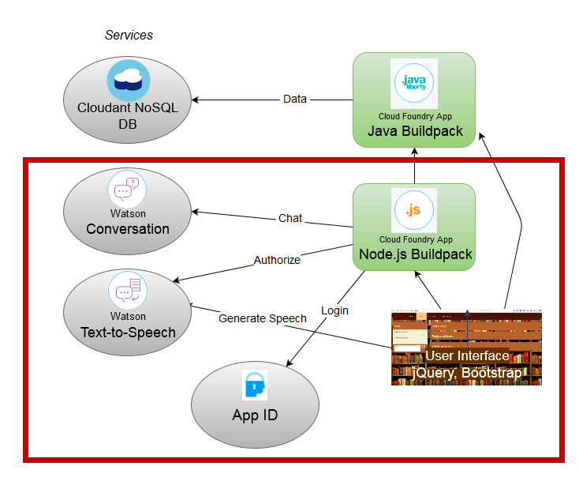

## Prerequisites
### Local tools
To create an app for the cloud, in this lab you will use an open toolchain in the cloud, provided by the Bluemix Continuous Delivery service. Therefore, you will only need a minimum of software locally for the subsequent steps:

* An up-to-date web browser, e.g. Firefox, Chrome, Safari, …
* Any text editor (like Eclipse, Atom, Brackets, vim … or whatever you prefer)
* Git client ([Download here](https://git-scm.com/downloads))

  Another requirement is an [IBM Bluemix Account](https://console.bluemix.net/registration).

### Library server (Java Backend)
For the sake of time, you will not create the Library service on your own during this lab, but instead use an instance provided to you.

If you are interested in how to create the Library service and want to do that yourself – AFTER this workshop – refer to the git repo [https://github.com/thomassuedbroecker/library-server-java-v2](https://github.com/thomassuedbroecker/library-server-java-v2.git).

Note, that all workshop participants will share the same Library service instance. During the test, you might experience data changes introduced by other participants. The “library” is open to all registered users.

#### Test the availability of the library service
•	The common Library service instance is available at the URL
https://library-server-tsuedbro.au-syd.mybluemix.net/

Open this URL in your browser.
The text "... Library Backend Server is running ..." should be displayed in your browser.

•	To check the connection to the Cloudant Database, add /api/books to the URL
(https://library-server-tsuedbro.au-syd.mybluemix.net/api/books ). You should see the books that were added to your books database as a json array.


## Deploy to IBM Cloud Public

1. Setup your application
2. Create the IBM Cloud Services and bind them to your application
3. Deploy our application
4. Integrate the IBM Cloud toolchain

### 1. Setup your application

1. Clone the app to your local environment from your terminal using the following command

    ```
    git clone https://github.com/cloud-dach/cf-hands-on-LibraryUI.git
    ```

	 Change to the resulting directory
  	```
    	cd cf-hands-on-LibraryUI
  	```

2. Open the file **manifest.yml** and change the entry **"LIBRARY_URI"** to the URL of the existing backend server, extended by **"/api"**. It should look like this:

      ```
      LIBRARY_URI: "https://library-server-tsuedbro.au-syd.mybluemix.net/api"
      ```

    Change the host name *LibraryUI-[myName]* to something unique. For example, you can replace [myName] with your name.

    ```
    applications:
    - name: LibraryUI
      host: libraryui-[myName]
      env:
        LIBRARY_URI: "https://library-server-tsuedbro.au-syd.mybluemix.net/api"
      memory: 256M
      instances: 1
    ```

3.  Login to bluemix.net and create a Node.JS Cloud Foundry App.
      Give it the same name (**LibraryUI**) and host name as defined in the **manifest.yml** file.

      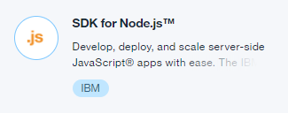

### 2. Create the IBM Cloud Services and bind them to your application

You will create following services: *Watson Text-to-Speech*, *Watson Conversation* and *App ID*.

1. Create and bind an instance of the *Watson Text-to-Speech* service.
	* In the app dashboard, navigate to the **Overview** section.  Click **Connect new** under **Connections**.
	* From the service catalog select the Watson Text-To-Speech Service. Leave all fields unchanged and click **Create**. You can hold off restaging the application until all services are bound.

2. Now create and bind a second service instance, a *Watson Conversation* service to the app.

    * Click **Connect new** under **Connections** again.
    * Select **Conversation** from the Bluemix Catalog in your Browser, make sure the *Free* pricing plan is selected and click **Create**. Again, you can hold off restaging the application until you finished the next step.
    * Click on the new *Conversation* service instance to open its main page. Open the **Manage** panel and click **Launch tool**.

        

    * Switch to the new tab or window, where the Conversation Management Tool has opened. Beside **Create workspace**, click the  **Import** icon.
    * Choose the file **conversation-workspace-v2.json** from your local copy of the LibraryUI directory, select **Everything (Intents, Entities, and Dialog)**, and click **Import**.

        

    * Go **back to workspaces** and click **View Details** on the Libray Helper workspace.

        

    * Copy the **Workspace ID** to the clipboard.
    * Replace it with the current value for *workspace_id_copy* in line 126 in **server.js**.

        ```
        //authenticate conversation service
        var workspace_id_copy = 'YOUR_WORKSPACE_ID';
        ```
3. Create and bind an instance of the *App ID* Service on IBM Cloud Public:

    * Return back to the LibraryUI app's dashboard and click **Connect new** under **Connections** one more time.
    * Select the *App ID* Service from the Catalog.
    * Name your service instance (or leave unchanged) and click **Create**.
    * You can keep the default configurations under *Identity Providers*, *Login Customization* and *Profiles*. Or you can adjust them as you choose, for example by uploading the image **views/images/bookshelf.jpg** in the login customization.
    * Connect it to the app LibraryUI and restage the application when prompted.

### 3. Deploy our application

Now you will push your application into the IBM Cloud Public.

```
    cf login -a https://api.[YOUR_REGION].bluemix.net
    Email> YOUR_EMAIL
    Password> YOUR_PASSWORD
    Authenticating...
    OK

    Select an org (or press enter to skip):
    1. YOUR_ORG

    Org> 1
    Targeted org YOUR_ORG
    Select a space (or press enter to skip):
    1. YOUR_SPACE

    Space> 1

    cf push LibraryUI
```

### 4. Integrate the IBM Cloud toolchain

1. Create a toolchain for this Cloud Foundry app:

      * In the **Overview** section of the app, click **Enable** under **Continuous Delivery**.

      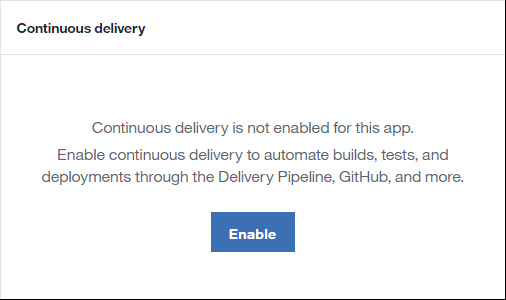

      * For the *Git Repos and Issue Tracking* tool, choose **repository type: new** to create a new git repository for your app.

      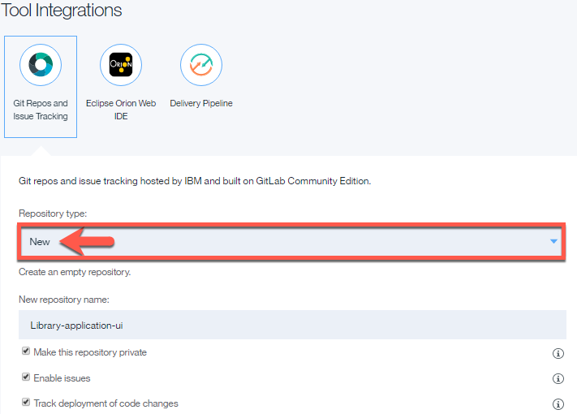

      Then click **Create** to create the new toolchain.

      * In the toolchain, hold the **Ctrl** (or **Strg**) key and click  on the **Git** icon in your toolchain. The associated  GitLab repository is opened in a new browser tab. So you can watch it there. Copy its URL from the browser.

      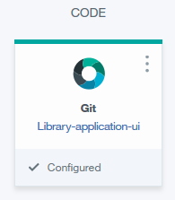

2. Using the **Git client** in a command window on your computer, push the application code to your git repository:

      1. Confirm your access to IBM GitLab, by pressing the button inside the IBM GitLab **confirmation mail**
	    2. Configure and commit the git repository.
         Use following commands:

         ```
              git config --global user.email "you@example.com"
              git config --global user.name "Your Name"
              git remote set-url origin <your-url>
              git add .
              git commit -m “first commit”
         ```
         * *\<your-url\>* should be replaced by the url of the GitLab repository: Choose the HTTPS protocol and copy the URL.

                  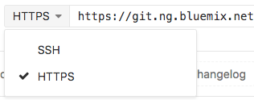

         * *you@example.com* should be replaced with your email address (the one you used to register for Bluemix).

         * *Your name* should be replaced with your name as it should appear in Gitlab.

                      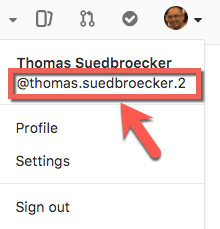

      3. For a push via https  protocol you need to generate a personal access token with 'api' scope for Git over HTTP. You can generate one at https://git.ng.bluemix.net/profile/personal_access_tokens

          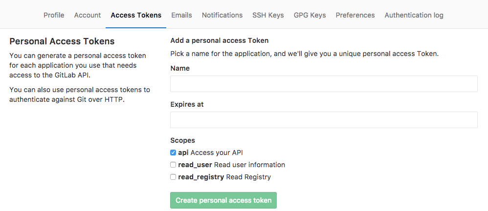

          Copy and save the token, and remember the name you picked.

      4. Push the code to GitLab.

          ```
          git push origin master
          ```
          You will be asked for Username and Password. Use the name of your token as Username and the token itself as Password.

          


    - **(OPTIONAL)** For a push via SSH you may need to add an **SSH key** to your GitLab account.
        To locate an existing SSH key pair:
        ```
        cat ~/.ssh/id_rsa.pub
        ```
        To generate a new SSH key pair:
        ```
        ssh-keygen -t rsa -C "your.email@example.com" -b 4096
        cat ~/.ssh/id_rsa.pub
        ```
        Copy the entire key starting with ssh-rsa.
        Then add your public SSH key to GitLab. Navigate to the 'SSH Keys' tab in your 'Profile Settings'.

          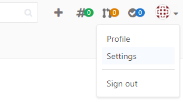

          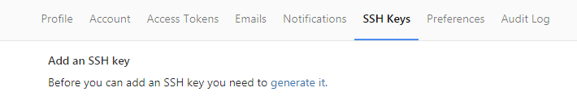

        Paste your key in the 'Key' section and give it a relevant 'Title'.

3. Go back to the Toolchain tab and open the *Continuous Delivery* tool. Trigger the **Build Stage** manually for this first time.
	* Click on the *Run Stage* icon in the **Build Stage**

	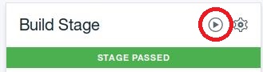

	* Watch the automatic build and deploy operations until the app is successfully deployed.

	**Note:** with the current configuration, the build and deploy stages will afterwards run automatically, whenever a change is pushed to the GitLab repository. If you have some time left, you may try this by introducing a simple code change and repeating the git commands *add*, *commit*, and *push* (see above).

4. Open the running app's URL either from the *Continuous Delivery* tool or the App dashboard in the Bluemix console.

_Note:_ You can use following commands to setup your local git integration.

```
        git init
        git remote set-url origin https://github.com/thomassuedbroecker/libraryui-v2.git
        git add -A
        git commit -m "init"
        git push
        cd docs
        chmod u+x *.sh
        ./git-commit.sh
```
